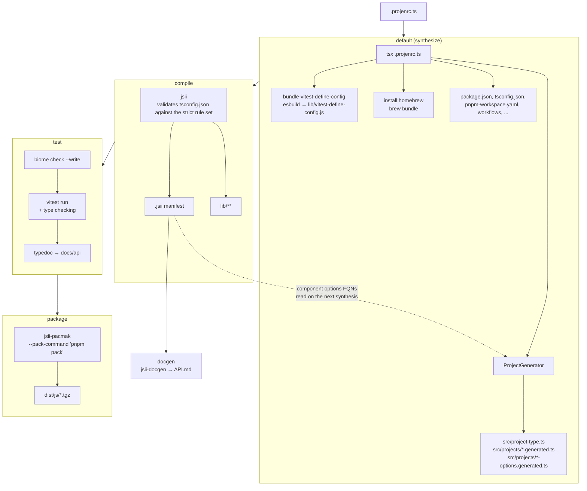

# @nikovirtala/projen-constructs

Projen project types with standard configuration for consistent project setup across all repositories.

## Installation

```bash
pnpm add -D @nikovirtala/projen-constructs projen constructs
```

Requires pnpm 11 and `projen` >= 0.101.27. `@mrgrain/cdk-esbuild` and `constructs` are peer
dependencies as well.

To create a project from scratch:

```bash
pnpm dlx projen new --from @nikovirtala/projen-constructs aws_cdk_construct_library
```

## Features

- **Standard Configuration**: Opinionated defaults for author, release branch, package manager, Node.js, TypeScript, and tooling
- **Automatic Project Type Discovery**: Generates the `ProjectType` enum from Projen's JSII manifest (19 project types)
- **Component System**: Reusable components (Vitest, TypeDoc, Mise, Homebrew, Colima, LocalStack, Lambda bundling)
- **Code Generation**: `ProjectGenerator` creates project classes with standard configuration
- **ES Modules**: TypeScript and CDK App projects use ES modules (JSII uses CommonJS)
- **Code Quality**: Biome for formatting and linting
- **Testing**: Vitest with coverage
- **Auto-merge**: Enabled with auto-approve
- **VSCode**: Recommended extensions and settings
- **mise**: Node version management

## Standard Configuration

- **Author**: Niko Virtala (niko.virtala@hey.com)
- **Default Release Branch**: main
- **Package Manager**: pnpm 11.20.0
- **Node Version**: 24.19.0
- **TypeScript**: 6.0.3
- **CDK Version**: 2.263.0 (for CDK projects)
- **JSII Version**: ~6.0.3 (for JSII projects)

The AWS CDK, Node.js and TypeScript versions live in `src/versions.json` and are refreshed by the
`update-versions` task, which the dependency upgrade workflow runs.

### pnpm

pnpm reads its settings from `pnpm-workspace.yaml`, not `.npmrc`, since pnpm 11. Generated projects
get:

| Setting                | Value             | Reason                                                                                                       |
| ---------------------- | ----------------- | ------------------------------------------------------------------------------------------------------------ |
| `nodeLinker`           | `hoisted`         | jsii tooling resolves dependencies from a flat `node_modules`                                                |
| `allowBuilds`          | `esbuild: true`   | esbuild links its platform binary in a postinstall script, and pnpm 11 fails an install with ignored builds   |
| `verifyDepsBeforeRun`  | `false`           | projen resolves the task `PATH` with `$(pnpm -c exec ...)`, which otherwise re-enters `pnpm install` and deadlocks |
| `minimumReleaseAge`    | `0`              | the pnpm 11 default of 1440 minutes makes pnpm write `minimumReleaseAgeExclude` entries into this generated file |

### TypeScript configuration

Projen renders three configs, and none of them should be edited directly:

- `tsconfig.json` compiles `src` to `lib`. For JSII projects, jsii validates it against its `strict`
  rule set, so it only carries compiler options jsii accepts.
- `test/tsconfig.json` extends it and is type-check only. This is the config Vitest type checking and
  the editor use, and the one `tsconfigDev` points at.
- `projenrc/tsconfig.json` covers `.projenrc.ts`.

## Customization

Override any option by passing it to the constructor:

```typescript
const project = new JsiiProject({
  name: "my-project",
  repositoryUrl: "https://github.com/nikovirtala/my-project.git",
  minNodeVersion: "24.0.0",
  author: "Custom Author",
  authorAddress: "custom@example.com",
  mise: false,
  vitest: false,
  tsconfig: {
    compilerOptions: {
      noUnusedLocals: false,
    },
  },
  biomeOptions: {
    biomeConfig: {
      formatter: {
        lineWidth: 100,
      },
    },
  },
});
```

Every component is exposed as an enable flag (`mise`, `vitest`, ...) plus an options property
(`miseOptions`, `vitestOptions`, ...).

## Usage

### Projects

#### AWS CDK Construct Library Project

```typescript
import { AwsCdkConstructLibraryProject } from "@nikovirtala/projen-constructs";

const project = new AwsCdkConstructLibraryProject({
  name: "my-cdk-construct",
  repositoryUrl: "https://github.com/nikovirtala/my-cdk-construct.git",
});

project.synth();
```

#### AWS CDK TypeScript App Project

```typescript
import { AwsCdkTypeScriptAppProject } from "@nikovirtala/projen-constructs";

const project = new AwsCdkTypeScriptAppProject({
  name: "my-cdk-app",
  repositoryUrl: "https://github.com/nikovirtala/my-cdk-app.git",
});

project.synth();
```

#### JSII Project

```typescript
import { JsiiProject } from "@nikovirtala/projen-constructs";

const project = new JsiiProject({
  name: "my-jsii-project",
  repositoryUrl: "https://github.com/nikovirtala/my-jsii-project.git",
});

project.synth();
```

#### TypeScript Project

```typescript
import { TypeScriptProject } from "@nikovirtala/projen-constructs";

const project = new TypeScriptProject({
  name: "my-typescript-project",
  repositoryUrl: "https://github.com/nikovirtala/my-typescript-project.git",
});

project.synth();
```

### Components

The package includes reusable components for common development tasks:

#### Vitest

[Vitest](https://vitest.dev) testing framework component.

```typescript
import { Vitest } from "@nikovirtala/projen-constructs";

new Vitest(project, {
  vitestVersion: "^4",
  config: {
    coverageProvider: CoverageProvider.V8,
    coverageReporters: [CoverageReporter.TEXT, CoverageReporter.LCOV],
  },
});
```

Type checking runs against the project's development tsconfig (`test/tsconfig.json`) unless
`config.typecheckTsconfig` says otherwise.

#### TypeDoc

[TypeDoc](https://typedoc.org) documentation generation component.

```typescript
import { TypeDoc, EntryPointStrategy } from "@nikovirtala/projen-constructs";

new TypeDoc(project, {
  version: "^0.28",
  typeDocConfig: {
    entryPointStrategy: EntryPointStrategy.EXPAND,
    out: "docs/api",
    exclude: ["**/*.test.ts"],
  },
});
```

#### Mise

[Mise](https://mise.jdx.dev) dev tools/runtimes management component.

```typescript
import { Mise } from "@nikovirtala/projen-constructs";

new Mise(project, {
  nodeVersion: "24.19.0",
});
```

#### Homebrew

[Homebrew](https://brew.sh) package management component. Writes a `Brewfile` and adds an
`install:homebrew` task that bootstraps Homebrew and runs `brew bundle`.

```typescript
import { Homebrew } from "@nikovirtala/projen-constructs";

const homebrew = new Homebrew(project, {
  packages: ["jq", "yq"],
});

homebrew.addPackage("gh");
```

#### Colima

[Colima](https://github.com/abiosoft/colima) container runtime component. Alternative for Docker.

```typescript
import { Colima } from "@nikovirtala/projen-constructs";

new Colima(project);
```

#### LocalStack

[LocalStack](https://www.localstack.cloud) AWS emulation component.

```typescript
import { LocalStack } from "@nikovirtala/projen-constructs";

new LocalStack(project, {
  services: ["s3", "lambda", "dynamodb"],
  port: 4566,
  debug: true,
});
```

#### LambdaFunctionConstructGenerator

Generates AWS CDK Lambda Function constructs and bundles their code.

```typescript
import { LambdaFunctionConstructGenerator } from "@nikovirtala/projen-constructs";

new LambdaFunctionConstructGenerator(project, {
  sourceDir: "src/handlers",
  outputDir: "src/constructs/lambda",
  filePattern: "*.lambda.ts",
  esbuildOptions: {
    minify: true,
    sourcemap: true,
  },
});
```

#### Bundler

Low-level bundling utilities for Lambda functions.

```typescript
import {
  Bundler,
  LambdaFunctionCodeBundle,
} from "@nikovirtala/projen-constructs";

const bundler = new Bundler(project, {
  assetsDir: "assets",
  esbuildVersion: "^0.25",
});

new LambdaFunctionCodeBundle(project, {
  entrypoint: "src/my-function.lambda.ts",
  extension: ".lambda.ts",
});
```

#### ProjectGenerator

Generates TypeScript project classes with standard configuration.

```typescript
import { ProjectGenerator, ProjectType } from "@nikovirtala/projen-constructs";

new ProjectGenerator(project, {
  name: "TypeScriptProject",
  projectType: ProjectType.TYPE_SCRIPT_PROJECT,
  filePath: "./src/projects/typescript.generated.ts",
  components: [
    { componentClass: Mise },
    { componentClass: Vitest }, // Auto-detects VitestOptions from JSII manifest
  ],
});
```

Features:

- Automatically generates the `ProjectType` enum from Projen's JSII manifest
- Auto-detects component options types from JSII manifests
- Strips Projen's `@pjnew` annotation from `packageManager`, which `projen new` would otherwise
  render into a generated `.projenrc.ts` as the package manager that ran the command
- Validates paths to prevent directory traversal attacks
- Structured error handling with custom error classes

## Development

This project is managed by Projen and generates itself: `.projenrc.ts` defines the project using the
`JsiiProject` type from `src/`. Configuration changes belong in `.projenrc.ts`, never in the
generated files.

```bash
pnpm projen           # synthesize project files
pnpm build            # synthesize, compile, test and package
pnpm test             # biome, vitest, typedoc
pnpm test:watch       # vitest in watch mode
pnpm test:update      # update snapshots
pnpm biome            # format and lint
pnpm docgen           # regenerate API.md from the .jsii manifest
pnpm update-versions  # refresh src/versions.json
pnpm upgrade          # upgrade dependencies
```

### Build process



The dashed edge is the part worth knowing about: `ProjectGenerator` reads the committed `.jsii`
manifest to resolve component options types, so the manifest produced by `compile` feeds the *next*
synthesis. This is why `.jsii` is committed rather than ignored. A component options type that is
missing from the manifest is reported as a warning and its options property is left out of the
generated interface, which is expected only while a new component is being introduced: compile once,
then synthesize again.

`package` runs `package:js` on CI and `package-all` locally; both end up in `jsii-pacmak`.
`docgen` is not part of `build` and has to be run explicitly after the manifest changes.
