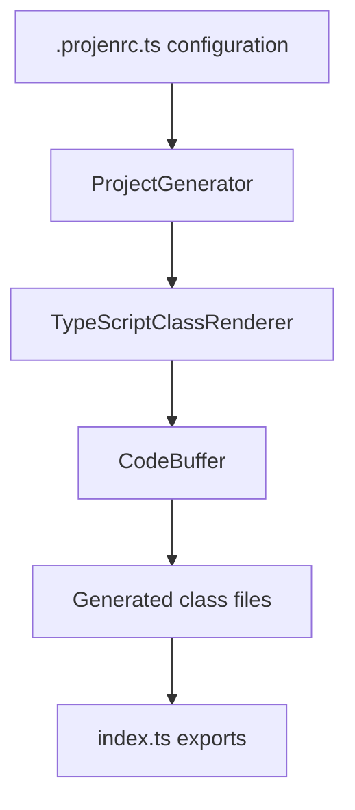

# Project generator

## Problem

Maintaining multiple Projen project classes with similar structure creates repetitive boilerplate code. Each project type (TypeScript, CDK, JSII) requires manual updates when adding components or changing configuration patterns.

## Solution

`ProjectGenerator` generates project class implementations automatically from configuration. The generator eliminates manual maintenance by creating classes that extend Projen base types with custom configuration and components.



## Architecture

The generator uses three components:

**CodeBuffer** manages indentation during code generation:

- `line(code)` adds a line of code
- `open(code)` adds a line and increases indentation
- `close(code)` decreases indentation and adds a line
- `flush()` returns generated lines and resets the buffer

**TypeScriptClassRenderer** renders TypeScript class code:

- Loads Projen's JSII manifest for base class introspection
- Validates base classes and options interfaces exist in JSII specs
- Extracts and sorts imports (external packages first, then relative)
- Generates type-only imports for interface files
- Renders class with constructor pattern
- Handles custom options extraction and default config application

**ProjectGenerator** orchestrates generation as a Projen component:

- Extends `Component` for lifecycle integration
- Runs during `preSynthesize()` phase
- Creates `TypeScriptClassFile` with generated content

## Usage

```typescript
import { ProjectType } from "./project-type";

new ProjectGenerator(project, {
  name: "TypeScriptProject",
  projectType: ProjectType.TYPESCRIPT,
  filePath: "./src/projects/typescript.generated.ts",
  components: [
    { component: Mise },
    { component: Vitest, optionsProperty: "vitestOptions" },
  ],
  additionalOptions: projectOptions,
  omitOptions: projectOmits,
});
```

## Generated code pattern

Each generated class follows this structure:

```typescript
import { baseModule } from "projen";
import { Mise } from "../components/mise";
import { Vitest } from "../components/vitest";
import { applyDefaults, defaultOptions } from "../config";
import { deepMerge } from "../utils";
import type { OptionsInterface } from "./options-file.generated";

export { OptionsInterface } from "./options-file.generated";

export class ClassName extends BaseClass {
  constructor(options: OptionsInterface) {
    const { mise, vitest, vitestOptions, ...baseOptions } = options;

    super(
      deepMerge<BaseOptionsType>(defaultOptions.module.ClassName, baseOptions)
    );

    applyDefaults(this, [
      { component: Mise, enabled: mise },
      { component: Vitest, enabled: vitest, options: vitestOptions },
    ]);
  }
}
```

## Key features

**Explicit project types**: Uses ProjectType enum for type-safe project identification. Each enum value maps directly to a Projen base class and its configuration path.

**Component-based**: Components are passed as class references, enabling dynamic instantiation.

**Structured defaults**: Default options follow the project type structure (`defaultOptions.typescript.TypeScriptProject`).

**Type-safe**: Uses `never` type for flexible component constructor signatures.

**JSII introspection**: Validates base classes and options interfaces against Projen's JSII manifest at generation time, ensuring type safety and catching configuration errors early.

## Project type mapping

The ProjectType enum provides explicit mapping between project types and their Projen base classes:

```typescript
enum ProjectType {
  TYPESCRIPT = "typescript.TypeScriptProject",
  JSII = "cdk.JsiiProject",
  AWS_CDK_TYPESCRIPT_APP = "awscdk.AwsCdkTypeScriptApp",
  AWS_CDK_CONSTRUCT_LIBRARY = "awscdk.AwsCdkConstructLibrary",
}
```

This eliminates fragile path-based naming and makes the relationship between project types and their configuration explicit.

## JSII introspection

The generator validates base classes and options interfaces against Projen's JSII manifest:

1. **Loads JSII manifest** - Reads Projen's `.jsii` file at construction time
2. **Validates base classes** - Ensures `projen.{module}.{ClassName}` exists
3. **Validates options interfaces** - Ensures `projen.{module}.{ClassName}Options` exists
4. **Fails fast** - Throws `InvalidBaseClassFormatError` if validation fails

This prevents runtime errors from invalid project type configurations and ensures generated code references valid Projen types.

## Comparison with jsii-struct-builder

| Feature       | jsii-struct-builder                  | ProjectGenerator                    |
| ------------- | ------------------------------------ | ----------------------------------- |
| Purpose       | Generate interfaces                  | Generate classes                    |
| Input         | JSII specs                           | Configuration objects + JSII specs  |
| Output        | TypeScript interfaces                | TypeScript classes                  |
| Pattern       | Builder pattern with transformations | Code generation with introspection  |
| Use case      | Type definitions                     | Implementation code                 |
| JSII usage    | Full spec transformation             | Validation and metadata extraction  |

## Integration

The `index.ts` file exports directly from generated files:

```typescript
export * from "./awscdk-construct-library.generated";
export * from "./awscdk-typescript-app.generated";
export * from "./jsii.generated";
export * from "./typescript.generated";
```
